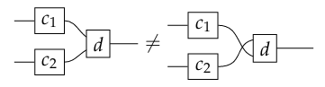
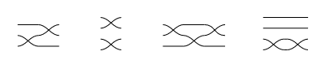
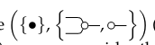
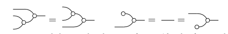
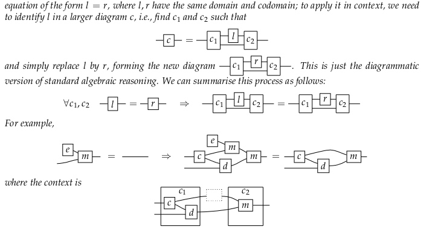

- 文法を介して形式言語の表現を指定するのを図式に一般化する
- 抽象代数を通してみていきましょう
- 代数的には、文法は言語の $signature$ を表現する手段
	- より複雑な式を構成するための演算のリスト
- $;$ を $p, p'$ を引数として $p;p'$ を返す二項演算子としてみた
	- $program\times program\to program$
- $skip, x:=y, x:=n$ も$program$ 型の定数とみなせる
- $\text{while }b\text{ do }p$ は $boolean\times program\to program$

---

- signature $\Sigma$ は2つの情報をもつ
	- operations $\Sigma_1$
	- objects(e.g. $program, boolean$ ) $\Sigma_0$
- 文法(1) から valid なプログラムを構築するのと同じ方法で $\Sigma$ の式を構成できる
- $\Sigma$ -terms

---

- sd は $\Sigma$ から作られる
- operations は複数入力、複数出力の場合もある
- variables は図で表現されることもある

### Signatures

- $\Sigma=(\Sigma_0, \Sigma_1)$

- $d:v\to w$ ：演算
- $v\in\Sigma_0^*$  ：$d$ の arity
- $w\in\Sigma_0^*$  ：$d$ の coarity

> **Note**
> arity と coarity のオブジェクトのリストに名前を付けなくていい場合は
>
> 

### Example 2.1

### Terms

- terms は signature を特定の方法で組み合わせることによって得られる
- 変数の集合 $Var$ と signature から帰納的に term を定義する

1. For each $x\in Var$, $x$ is a term
2.  For each $f\in \Sigma$, arity $n$ について、もし $t_1,...,t_n$ が term なら、 $f(t_1,...,t_n)$ は term

- sd 的なシンタックスでは、term は同じような感じで作られるが、重要な違いが2つある
	1. $variable-free$
	2. $\Sigma$ 中の演算を帰納的に組み合わせる方法は、表現したいグラフ構造の richness による

---

- 標準的には、symmetric モノイド構造に依存する
	- $\Sigma_1$ の演算はいくつかの *built-in (identity, symmetry, null)* の演算の組み合わせ
- $\Sigma=(\Sigma_0,\Sigma_1)$ を固定すると、$\Sigma$ -terms は以下の導出ルールで生成される
	1. $\Sigma_1$ の全ての演算は term を生成する

		

	2. それぞれの built-in 演算 (identity, symmetry, null) は term を生成する

		

	3. inductive step として、新しい term は2つの term を組み合わせて作られる
		1. sequentially

			

		2. parallel

			

- この組み合わせのルールを使うと、 $\Sigma_0$ 上の任意の words $v,w$ に対して同一性と対称性を定義できる
	- words が組み合わせ可能ということっぽい

	

- built-in terms と term を組み合わせる方法を変えると、対称的なモノイド構造 **ではない** 構造ができる

---

- null が表示されていないことに注意！
	- 空の dotted box として表現されている
- terms の type は生成アルファベット上の word のペア
- だから、arity または coarity として空の word $\epsilon$ を持てる
- $d:\epsilon\to w$ の type の term (sometimes called $state$ )

	

- $d:w\to\epsilon$ の type の term (sometimes called $effect$ )

	

- $d:\epsilon\to\epsilon$ の type の term (sometimes called $scalar, closed\text{ }term$ )

	

### String Diagrams

- term は sd と全く同じではない
- もっと複雑な term を検討すると、追加の表記法が必要になってくる
- Example 2.1 から、以下の term を構成してみる

- dotted boxes が嫌なので、必要なくなるように term の quotient をとります（分けます）
- $\Sigma$ 上の sd は $\Sigma$ -terms の等価クラスとして定義される
- quotient は以下の等式の反射的、対称的、推移的な閉包に関して取られる

> **Note**
> みやすさのために object のラベルは省略されている

- 以下の規則(5) は、sd の等価な変形

	

- 上の行は **termの特定の括弧は問題ではない** ことを示している
	- dotted frame を *2 次元の括弧* として考える
	- 代数では $(a\cdot b)\cdot c=a\cdot(b\cdot c)=a\cdot b\cdot c$
		- もっといい書き方もある
		- $a\cdot b\cdot c=abc$
- 2 行目は左端が特に重要
	- 2 つの構成要素間の相互作用に関するもの
	- **2 つの連続して構成された項を並列/直列に組み合わせても同じ！**
- 下の行は wire の交差にまつわる法則
	- box の接続方法を変えなければ、wire を横切って box を引っ張ってこれる
	- ワイヤーは絡まったり、解けたりする

---

- (5)で、Example 2.1 の dotted frames が取り除ける

	

- ここどの規則使ってんのかよくわかんないや
	- 雰囲気こう（多分違う）

		

- ここで大事なのは、sd がさっきの法則で quotient された等価クラスの場合、固有表現はないということ
	- dotted frame なしのグラフ表現は、以下のような等価なterm を区別しないので、term と diagram の間に位置する

		

- でも、sd のかきかたによって、等価な表現なのに区別されるものもある

	

- 同じ数だけ wire が交差している sd は等価

	
  - 他の規則が結合性2次元ver. なら、wire-crossing axiom は可換性 2次元ver. といえる
    - $abc=bac=acb$
  - 垂直方向の並置に対して厳密には box は可換ではない
  - けど、wire を横切って box を引っ張ってこれる！
  - 演習として、この定理を示してください
    - 大事なのは wire をどう並べ替えたかだけで、構築方法ではない

		
		- 単に box を一個ずつ移動しているだけ

---

- これらの例は、sd の区別と sd の図での表現が無害であることを示している
  - (5) -> "only the connectivity matters"
  - box 間の接続を維持 + wire を後ろに曲げない変形は、等価な sd を生成する

- box の接続ポイントは区別されるので以下の2つは等価ではない

	

### Definition 2.2

- $\Sigma$ 上の sd は、(5) の等式で quotient された $\Sigma$ -term である

### Example 2.3

- 以下の（フレームがない）terms は同じ図

	

### Syntax and Free SMC

- 生成 operation の set に対して特定の種類の $free$ structures をとることで、数学的に正確に構文を定義できる
- $Free$ symmetric monoidal category (SMC, 自由対称モノイド圏？) が 付随する

---

- SMC とは、sd を解釈できる構造（なんだそれ）
  - (5) の等式を満たす、object と morphism (射) に対する演算 (monoidal product) を持つ圏

### Definition 2.4

- （厳密な）SMC $(\mathrm{C}, \otimes, I, \sigma)$ は、区別された object $I$, object に対する二項演算 $\otimes$ 、$\otimes$ とも書く射に対する型 $\mathrm{C(X_1, Y_1)\times C(X_2, Y_2)\to C(X_1\otimes X_2, Y_1\otimes Y_2)}$ の演算、どのような2つのオブジェクト $X, Y$ に対しても以下であるような射の族 $\sigma_X^Y$ ：
  - $id_{X\otimes Y}=id_X\otimes id_Y$

$$\begin{aligned}(c_1\otimes c_2);(d_1\otimes d_2)&=(c_1; d_1)\otimes(c_2;d_2)\\c_1\otimes(c_2\otimes c_3)&=(c_1\otimes c_2)\otimes c_3\\id_I\otimes c&=c=c\otimes id_I\\(id_X\otimes c); \sigma_X^Z&=\sigma_X^Y;(c\otimes id_X)\quad\text{for any }c: Y\to Z\\\sigma_X^Y; \sigma_Y^Z&=id_X\otimes id_Y\end{aligned}$$

- 最後の式たちは、(5) を記号的に表したもの
- $\otimes$ は垂直方向の合成、 $;$ は水平方向の合成
  - string diagram って2次元の monoid ぽい？

---

- あらゆる diagrams を記号形式に変換できる
- Example 2.3 の図を記号形式に変換すると、
  $$(d\otimes id \otimes f \otimes id);(id\otimes g\otimes\sigma);(e\otimes h\otimes id)$$

	

- 図のときと同様に、1つの射の記号的な表記方法は複数ある
  - 図は SMC の法則の一部を吸収するので、図の場合のほうが表現の種類は少ない

### Remark 2.5

- **strict** monoidal category
- coherence theory
	- 全ての SMC(symmetric monoidal category) は strict SMC と等価である
- これがあるから sd がかける
  - $\otimes, ;$ を考えずに済む

### Definition 2.6

- SMC: Free$_{SMC}(\Sigma)$ は、
  - objects は $\Sigma_0^*$ の要素
  - 射は $\Sigma$ 上の sd
- monoid 積は object 上の単語の連結
- sd の合成
  - $\Sigma$ -term の逐次合成
- sd の積
  - $\Sigma$ -term の並列合成

### Remark 2.7

1. diagram 上の等価関係は決定可能
2. この構文の term を特定のグラフとして見ることができて、2つの同じグラフの term は構造的に厳密に等価

### Example 2.8

- signature $\Sigma=(\{\cdot\},\emptyset)$ 上の Free SMC
  - 演算の対象がないような signature
  - object (box) がなくて wire だけ

	

---

- 単一の生成 object 上の Free SMC は PROP(**Pro**duct and **P**ermutation categories) と呼ばれる
  - ワイヤーの順列！
- 上の図は 'simplest' possible PROP
  - more formally, it is the initial object in the category of PROPs

- **Coloured** PROPs: 任意の生成 object の集合から object の集合が自由に生成される SMC
	- さっきから自由自由ってなんなんだ...わかんないよ...
    	- 多分同じ object の生成の仕方が複数通りあるからだと思う
      - どこからどんな順番で作ってもいい的な

> **Note**
> この SMC と 単一の object をもつ SMC はよくにているが、これを示すには、2つの間に同型写像があることを言えばいい

### Symmetric Monoidal Functors

- SMC 間に対応するマッピングの概念は、*Symmetric monoidal functor*
  - String diagram に解釈を与えるのに必要になる

### Definition 2.9

- $(C, \otimes)$ と $(D, \boxtimes)$ を SMC とし、それぞれの単位元を $I, J$ 、対称な関係を $\sigma, \theta$ とする
- 厳密な symmetric monoidal functor $F: (C, \otimes)\to (D, \boxtimes)$ は、次を満たす C の object から D の object への写像

	$$F(X_1\otimes X_2)=F(X_1)\otimes F(X_2)\quad and \quad F(I)=J$$

- また、次を満たす C の射から D の射への写像

	$$F(c;d)=F(c).F(d)\quad F(id_X)=id_{F(Y)}\quad F(c_1\otimes c_2)=F(c_1)\boxtimes F(c_2)\quad F(\sigma_X^Y)=\theta_{F(X)}^{F(Y)}$$

- ここで、$(C, \otimes), (D, \boxtimes)$ の構成をそれぞれ ';' および '.' と書いている

---

- この introduction では、*strict* monoidal functors に限定している。
  - 正確にモノイド構造を保つ
    - モノイド構造を壊しちゃう functor もあるか ありそう確かに
- さっきのobject への写像を同型写像(isomorphisms) に置き換えることで条件を緩和できる

---

- 互いに逆関数になっているような2つのファンクタ F: $(C, \otimes)\to(D, \boxtimes)$ と G: $(D, \boxtimes)\to(C, \otimes)$ がある場合に、2つの SMC は同型であるという
  - $FG=GF$ は恒等関数

### Example 2.10

- ぜんぜんわからん、また今度読む

## 2.1 Adding Equations

- symmetric monoidal theory 対象モノイド理論
	- Signature $\Sigma$ 上の、同じ arity と coarity を持つ sd のペアの集合
	- equalities と解釈される *axioms*
	- theory $E$ : = の上に E がのったやつって書く

### Example 2.11

 ← こういうシグネチャが与えられたとき

1. 結合性
2. 単位元の存在
	- を表している

### Remark 2.12

- 抽象代数に詳しくないのでとばします

### Remark 2.13

- おなじ始域と終域をもつ $l, r$ があったとき
- こういう感じで単に $l$ を $r$ で replace してやればいい
- これ激アツな気がする

### Free SMC over an equational theory

- $\Sigma$ 上の freeSMC も sd と同じように自由な構造を示す
- シグネチャ $\Sigma$ と 理論 $E$ が与えられたときに、Free SMC $\mathrm{Free}_{SMC}(\Sigma, E)$ をシグネチャの等価の関係から得られる

### Definition 2.14

- word が自由に生成できるし等価ですよって話
